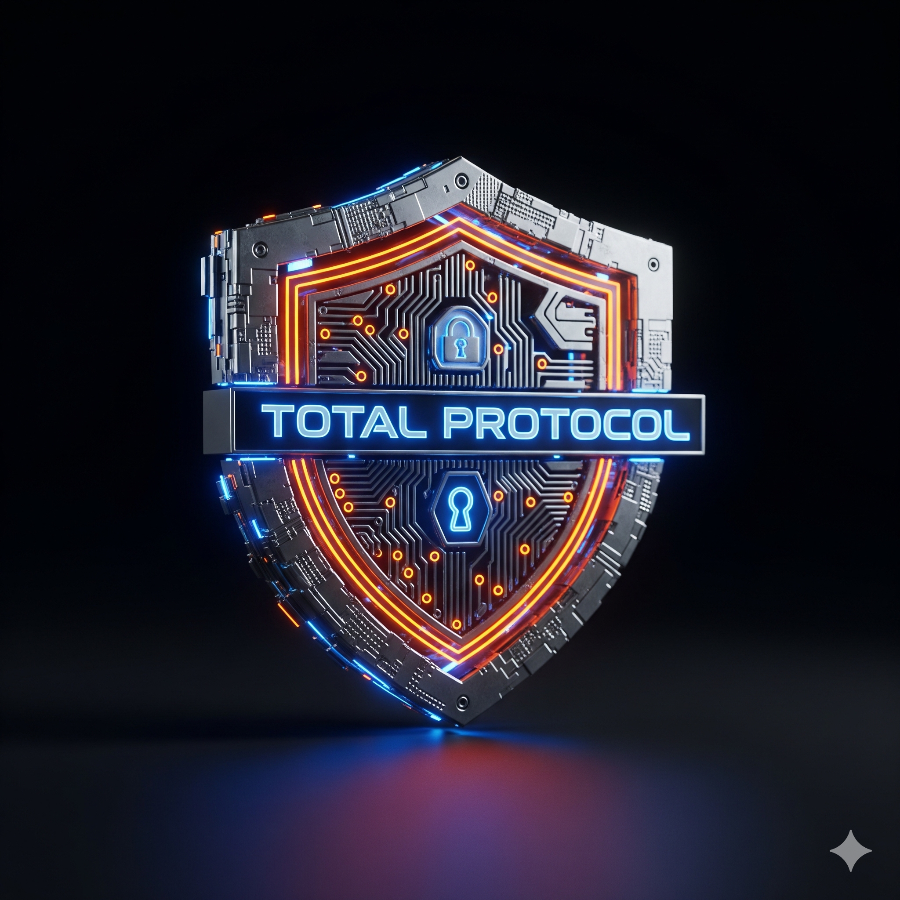

# TOTAL Protocol: Sentinel Core v.8.1
### "Absolute Zero" — Hardware-Software Symbiosis
<p align="center">

</p>
<p align="center">


</p>
---
## 🚀 Overview
**TOTAL Protocol** is a hyper-secure Layer 2 infrastructure that solves the "Security-Speed Paradox" through hardware-software symbiosis. Version 8.1 introduces **Absolute Zero** security—a state where the protocol is protected by the laws of physics, quantum mechanics, and hardware-level invariants.
### 🏛 The Hybrid Architecture
* **📡 Sentinel Core (v.8.1):** FPGA-driven hardware heart. Executes **Poseidon ZK-Proofs** at nanosecond speeds with integrated SIEM monitoring.
* **🛠 Hardware-Enforced Layer:**
    * **FPGA Acceleration:** Custom Verilog modules for Poseidon Hash acceleration.
    * **NTT Butterfly Unit (v.8.1):** Optimized modular arithmetic block for nanosecond transaction finality.
* **📜 Sentinel Lite (Execution):** High-speed Go-based EVM node with hardware-enforced memory isolation and state-drift protection.
* **💎 $TOTAL Engine:** Entropy-backed economic model powered by physical **Ring Oscillator TRNG**.
---
## 🛡️ Security Framework: Unified Defense Matrix (v.6.2)
Sentinel v.8.1 employs a multi-layered active defense strategy, classifying threat vectors into specific echelons of resilience.
| Technology | Protection Focus | Verification Method | Status |
| :--- | :--- | :--- | :--- |
| 🧬 **Poseidon ZK** | Arithmetic circuit integrity | Formal Invariant Check | ✅ **Verified** |
| 🧬 **QRNG (RO)** | Physical Entropy | Entropy Stuck-at Check | ✅ **Active** |
| ❄️ **Thermal Guard** | Active Cooling & Isolation | Peltier Logic Migration | ✅ **Secure** |
| 🛰️ **Temporal Sync** | Hardware Atomic Clock | <1ps Drift Fail-safe | ✅ **Active** |
| 👻 **Ghost Logic** | Polymorphic Mutation | Multi-zone Heartbeat | ✅ **Locked** |
---
## 📊 Operational Metrics (Real-time SIEM)
* **TTD (Time To Detect):** < 450ms (Hardware), < 15s (Logic).
* **FP Rate:** < 0.004% (Verified via Live Telemetry).
* **Compliance:** Automated digests generated for institutional auditors.
---
## 🛠 Quick Start (Audit Sandbox)
Experience the speed of **Atomic Hardware Finality** and test the defense matrix using our Dockerized simulation environment.
```bash
# Build the Sentinel Core v.8.1 Environment
docker build -t total-protocol .
# Launch the Absolute Zero Demonstration
docker run total-protocol
The simulation executes a hardware-software handshake, verifies Bus Integrity, and demonstrates protection against Co-Temperature attacks.
​📂 Repository Structure
​/cmd/orchestrator — System "Brain" & Execution (Go)
​/internal/core — Sentinel Guard & Hardware Oracle (Go)
​/hardware — QRNG Entropy Watchdog & FPGA Logic (Verilog)
​/simulation — ZK-Accelerator & Poseidon Models (C++)
​/frontend — Real-time Security SIEM Dashboard (HTML/JS)
​🗺️ Roadmap: The Iron Age
​Phase 1: Genesis — TGE & Coinbase Institutional Custody integration.
​Phase 2: Quantum Era — Activation of Global QRNG Entropy Anchor & Post-Quantum Upgrades.
​Phase 3: Iron Age — Sentinel Core v.8.1 Mainnet Launch & ASIC Migration.
​<p align="center">
<b>TOTAL Status: ACTIVE (Synced with Sentinel SIEM)</b> | <i>"In Physics We Trust."</i>


<sub>Developed by an International Group of Developers</sub>
</p>
